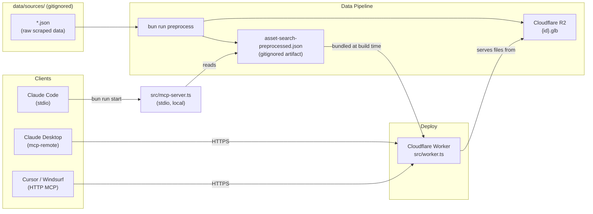
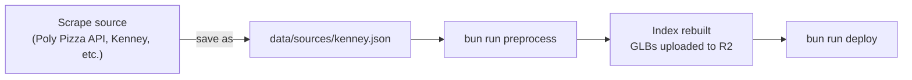

# 3d-assets-search MCP Server

Searches 1,400+ free low-poly 3D assets (Quaternius) by name, category, or animation clip.
Returns direct GLB download URLs usable immediately in Three.js / React Three Fiber.

## How it works



**Sources are NOT committed to git** — `data/sources/*.json` files are gitignored (keep the folder with `.gitkeep`).
The preprocessed JSON is a derived artifact (also gitignored) that is regenerated by `bun run preprocess`.
Preprocess optionally uploads GLBs to R2 if credentials are configured.

## Tools

| Tool                   | Description                                                                                                               |
| ---------------------- | ------------------------------------------------------------------------------------------------------------------------- |
| `search_assets`        | Full-text search with synonym expansion. Returns ranked GLB URLs.                                                         |
| `list_animation_clips` | Lists all unique clip names, optionally filtered by category. Call before `search_assets` to discover what motions exist. |
| `list_categories`      | Lists every asset category with counts.                                                                                   |
| `get_asset`            | Fetches full details for one asset by ID.                                                                                 |

### Synonym expansion

`search_assets` understands semantic intent:

| Query    | Also matches                          |
| -------- | ------------------------------------- |
| `run`    | Gallop, Running, Sprint               |
| `attack` | Bite, Punch, Slash, Stab, Sword, Kick |
| `die`    | Death, Dead                           |
| `hit`    | HitReact, HitReceive                  |
| `human`  | Character, Person, Man, Woman         |
| `quad`   | Horse, Wolf, Cow, Deer, Dog, Cat      |

## Setup

### 1. Install dependencies

```bash
bun install
```

### 2. Get source data

Place your source JSON files in `data/sources/`:

```bash
# Example: copy or fetch quaternius.json into data/sources/
cp /path/to/quaternius.json data/sources/
```

The `data/sources/` folder is kept in git via `.gitkeep`, but `.json` files are gitignored.

### 3. Configure R2 (optional — for GLB uploads)

Copy `.env.example` → `.env` and fill in R2 credentials if you want `preprocess` to upload GLBs:

```bash
cp .env.example .env
# Edit .env with your Cloudflare account ID and R2 API tokens
```

Preprocess will skip uploads if credentials are missing (URLs are still rewritten to R2 format).

### 4. Build the search index

```bash
bun run preprocess
```

Reads `data/sources/*.json` → uploads GLBs to R2 (if creds available) → writes `data/asset-search-preprocessed.json`.

Must run at least once before starting the local server. `bun run start` and `bun run dev`
re-run it automatically via `prestart`/`predev` hooks.

### 5. Register in Claude Code / Claude Desktop (local stdio)

Add to your project's `.mcp.json`:

```json
{
  "mcpServers": {
    "3d-assets-search": {
      "command": "bun",
      "args": ["mcp-servers/3d-assets-search/src/mcp-server.ts"]
    }
  }
}
```

> The server will exit with a clear error if the preprocessed index is missing — run
> `bun run preprocess` inside `mcp-servers/3d-assets-search/` first.

## Cloudflare Workers deployment (remote MCP)

`src/worker.ts` is the Cloudflare Workers entry point. It bundles the preprocessed index
at build time and serves GLB files from R2.

### Dev

```bash
bun run dev        # wrangler dev → http://localhost:8787/mcp
```

Test with MCP Inspector:

```bash
npx @modelcontextprotocol/inspector http://localhost:8787/mcp
```

### Deploy

```bash
bun run deploy     # rebuilds index (predeploy hook) + wrangler deploy
```

The `predeploy` hook runs `bun run preprocess` automatically — no manual step needed.

### Connect to the remote Worker

Via `mcp-remote` (for clients without native HTTP MCP):

```json
{
  "mcpServers": {
    "3d-assets-search-remote": {
      "command": "npx",
      "args": ["mcp-remote", "https://assets.fried.gg/mcp"]
    }
  }
}
```

Cursor / Windsurf support direct HTTP MCP — enter `https://assets.fried.gg/mcp` directly.

## R2 asset storage

The Worker serves GLBs from R2 at `/files/:id.glb` with `Cache-Control: immutable`.
URLs are rewritten to R2 format during `bun run preprocess` — callers always receive R2 URLs.

```
GET https://assets.fried.gg/files/{asset-id}.glb
```

### First-time R2 setup

1. The `3d-assets` bucket already exists. Get R2 S3-compatible credentials:
   - Go to [dash.cloudflare.com](https://dash.cloudflare.com) → R2 Overview → **Manage R2 API Tokens** (right panel)
   - Create API Token → Object Read & Write → scope to bucket `3d-assets`
   - Copy credentials into `.env` (`R2_ACCESS_KEY_ID` + `R2_SECRET_ACCESS_KEY`)

2. Run preprocess to upload GLBs:

   ```bash
   bun run preprocess   # uploads GLBs to R2 (skips files already present)
   ```

## Adding new asset sources



**Step 1 — Drop a JSON file in `data/sources/`**

The filename becomes the creator name. `kenney.json` → creator `"Kenney"`.

Each file must be a JSON object with an `assets` array:

```jsonc
// data/sources/kenney.json
{
  "assets": [
    {
      "id": "kenney-car-001",
      "title": "Car",
      "category": "Vehicles",
      "tags": ["car", "vehicle"],
      "animated": false,
      "animationClips": [],
      "license": "CC0",
      "triCount": 320,
      "thumbnail": "https://...",
      "download": "https://...",   // source URL — used by preprocess to fetch the GLB
      "polyPizzaUrl": "https://...",
    },
  ],
}
```

**Poly Pizza** — The Quaternius source was built from:
`https://api.poly.pizza/v2/user/{userId}/models`

**Step 2 — Rebuild index and sync GLBs**

```bash
bun run preprocess   # preprocess + optional R2 upload (skips existing)
```

**Step 3 — Deploy**

```bash
bun run deploy
```

## Project structure

```
3d-assets-search/
├── data/
│   ├── sources/                       # raw per-creator JSONs (gitignored, .gitkeep keeps folder)
│   │   ├── .gitkeep
│   │   └── quaternius.json            # place source files here (not committed)
│   └── asset-search-preprocessed.json # built search index (gitignored — derived artifact)
├── scripts/
│   └── preprocess.ts                  # sources/ → preprocessed JSON + optional R2 upload
├── src/
│   ├── mcp-server.ts                  # stdio entry — local Claude Code / Desktop
│   ├── worker.ts                      # CF Workers entry — HTTP MCP + R2 file serving
│   ├── worker-configuration.d.ts      # generated by `bun run cf-typegen`
│   ├── searcher.ts                    # search, listClips, getAssetById
│   ├── tokenizer.ts                   # tokenize, expandTokens, synonym map
│   ├── tools.ts                       # MCP tool definitions (shared by both transports)
│   └── types.ts                       # Zod schemas + inferred TypeScript types
├── tests/
│   ├── fixtures/mock-index.ts
│   ├── tokenizer.test.ts
│   ├── searcher.test.ts
│   └── mcp-server.test.ts
├── wrangler.jsonc
├── .env.example
├── vitest.config.ts
├── lefthook.yml
├── package.json
└── tsconfig.json
```

## npm scripts

| Script               | What it does                                                                        |
| -------------------- | ----------------------------------------------------------------------------------- |
| `bun run preprocess` | `data/sources/*.json` → `data/asset-search-preprocessed.json` + optional R2 upload |
| `bun run start`      | Rebuild index (`prestart`) then start local stdio MCP server                        |
| `bun run dev`        | Rebuild index (`predev`) then `wrangler dev`                                        |
| `bun run deploy`     | Rebuild index (`predeploy`) then `wrangler deploy`                                  |
| `bun run test`       | Run tests                                                                           |
| `bun run cf-typegen` | Regenerate `src/worker-configuration.d.ts`                                          |

## Roadmap

- [ ] **Vectorize semantic search** — replace keyword search with Cloudflare Vectorize + Workers AI (`@cf/baai/bge-small-en-v1.5`). Requires `wrangler vectorize create 3d-assets --preset @cf/baai/bge-small-en-v1.5`, a `scripts/seed-vectorize.ts` to embed and upsert all assets, and adding `ai` + `vectorize` bindings back to `wrangler.jsonc`. `list_categories` and `list_animation_clips` stay as bundled lookup data.
- [ ] **Additional asset sources** — add `data/sources/kenney.json` etc.; `bun run preprocess` picks them up automatically.
